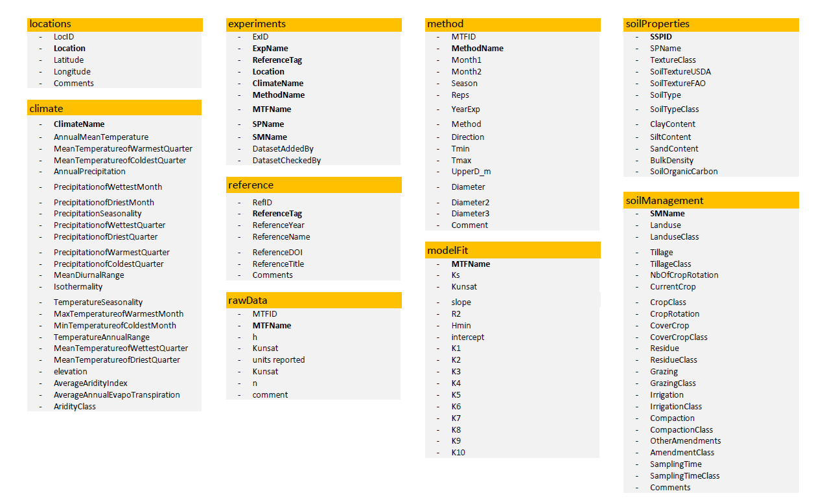

# Open-source Tension-disk Infiltrometer Meta-Databse (OTIM-DB)

This repository is part of the [EJP SOIL CLIMASOMA project](https://ejpsoil.eu/soil-research/climasoma/).

This database contains data and meta-data of tension-disk infiltrometer measurements on soil from peer-reviewed scientific publications. 

The OTIM-DB.xlsx is a relational database structured in several tables, each of them in an individual spreadsheet. The figure below illustrates the overall structure of the database. The keys of the individual tables are shown in bold.



A meta-analysis was carried out, including an **exploratory data-analysis** and a calculation of **effect sizes** for specific factors (landuse, tillage, compaction, sampling time) on the saturated and near-saturated hydraulic conductivity.

This repository contains:
- [data/OTIM-DB.xlsx](data/OTIM-DB.xlsx): the OTIM database
- [notebooks/otim-fit.ipynb](notebooks/otim-fit.iypnb): fits of a linear relationships in log-space between the hydraulic conductivity and the applied tension
- [notebooks/otim-eda.iypnb](notebooks/otimdb-eda.ipynb): exploratory data analysis (EDA) of the database
- [notebooks/meta-analysis.ipynb](notebooks/meta-analysis.ipynb): calculation of effect sizes for specific factors on saturated and near-saturated hydraulic conductivity
- [interactive EDA](https://climasoma.github.io/otim-db/eda-plotly.html): a tool to interactively explore the database (beta)

## Citation
Refer to this citation if you make use of the database:
```
CLIMASOMA authors. 2022. "Open-source Tension-disk Infiltrometer Meta-Databse (OTIM-DB)" CLIMASOMA report. https://doi.org/10.20387/bonares-q9b3-z989
```

